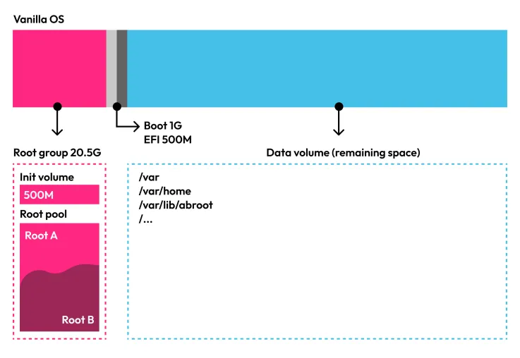

<div align="center">
  
  <h1 align="center">ABRoot v2</h1>
  <p align="center">ABRoot is utility which provides full immutability and
    atomicity to a Linux system, by transacting between two root filesystems.
    Updates are performed using OCI images, to ensure that the system is always
    in a consistent state. It also allows for local atomic changes thanks to
    the integrated ABRoot package manager, which generates local OCI images
    with the user's changes, and then applies them on top of the system's
    default image.</p>
</div>

> **NOTE**: ABRoot v2 is currently in development. The current stable release
> is v1, which is available in the `v1` branch.

## Help output

```md
ABRoot provides full immutability and atomicity by performing transactions between 2 root partitions (A<->B)

Usage:
  abroot [command]

Available Commands:
  completion  Generate the autocompletion script for the specified shell
  help        Help about any command
  kargs       Manage kernel parameters
  pkg         Manage packages
  rollback    Return the system to a previous state
  status      Display status
  upgrade     Update the boot partition

Flags:
  -h, --help      help for abroot
  -v, --verbose   Show more detailed output
      --version   version for abroot

Use "abroot [command] --help" for more information about a command.
```

## Installation

ABRoot is a single binary, which can be placed anywhere on the system. It
requires administrative privileges to run and a configuration file to be
present in one of the following locations, ordered by priority:

- `~/.config/abroot/abroot.json` -> for user configuration
- `config/abroot.json` -> for development purposes only
- `../config/abroot.json` -> for development purposes only
- `/etc/abroot/abroot.json` -> for administrative configuration
- `/usr/share/abroot/abroot.json` -> for system-wide configuration

The configuration file is a JSON file with the following structure:

```json
{
    "autoRepair": true,
    "maxParallelDownloads": 2,

    "registry": "ghcr.io",
    "registryService": "registry.ghcr.io",
    "registryAPIVersion": "v2",
    "name": "vanilla-os/desktop",
    "tag": "main",

    "iPkgMngPre": "lpkg --unlock",
    "iPkgMngPost": "lpkg --lock",
    "iPkgMngAdd": "apt install -y",
    "iPkgMngRm": "apt remove -y",
    "iPkgMngApi": "https://packages.vanillaos.org/api/pkg/{packageName}",
    "iPkgMngStatus": 0,

    "differURL": "https://differ.vanillaos.org",

    "partLabelVar": "vos-var",
    "partLabelA": "vos-a",
    "partLabelB": "vos-b",
    "partLabelBoot": "vos-boot",
    "partLabelEfi": "vos-efi",
    "PartCryptVar": "/dev/mapper/vos--var-var",

    "thinProvisioning": false,
    "thinInitVolume": "",

    "libPathStates": "/var/lib/abroot/states"
}
```

The following table describes each of the configuration options:

| Option | Description |
| --- | --- |
| `autoRepair` | If set to `true`, ABRoot will automatically try to repair the system if a broken structure is detected during a transaction. |
| `maxParallelDownloads` | The maximum number of parallel downloads to perform when updating the system. |
| `registry` | The registry to use when pulling OCI images. |
| `registryService` | The registry service to use when pulling OCI images. |
| `registryAPIVersion` | The Docker Registry API version to use when pulling OCI images. (Only `v2` is tested) |
| `name` | The name of the OCI image to use when pulling OCI images. |
| `tag` | The tag of the OCI image to use when pulling OCI images. |
| `iPkgMngPre` | The command to run before performing any package management operation. This is useful to keep the package manager locked outside of a transaction. It can be a command or a script. |
| `iPkgMngPost` | Similar to `iPkgMngPre`, but runs after the package management operation. |
| `iPkgMngAdd` | The command to run when adding a package. It can be a command or a script. |
| `iPkgMngRm` | The command to run when removing a package. It can be a command or a script. |
| `iPkgMngApi` | The API endpoint to use when querying for package information. If not set, ABRoot will not check if a package exists before installing it. This could lead to errors. Take a look at our [Eratosthenes API](https://github.com/Vanilla-OS/Eratosthenes/blob/388e6f724dcda94ee60964e7b12a78ad79fb8a40/eratosthenes.py#L52) for an example. |
| `iPkgMngStatus` | The status of the package manager feature. The value '0' means that the feature is disabled, the value '1' means enabled and the value '2' means that it will require user agreement the first time it is used. If the feature is disabled, it will not appear in the commands list. |
| `differURL` | The URL of the [Differ API](https://github.com/Vanilla-OS/Differ) service to use when comparing two OCI images. |
| `partLabelVar` | The label of the partition dedicated to the system's `/var` directory. |
| `partLabelA` | The label of the partition dedicated to the system's `A` root. |
| `partLabelB` | The label of the partition dedicated to the system's `B` root. |
| `partLabelBoot` | The label of the partition dedicated to the master boot. |
| `partLabelEfi` | The label of the partition dedicated to the EFI boot. |
| `PartCryptVar` | The encrypted partition to unlock during boot. On a non-lvm setup this would be something like `/dev/nvme1n1p3`. |
| `thinProvisioning` | If set to `true`, ABRoot will use and look for a thin provisioning setup. Check the section about [thin provisioning](#thin-provisioning) for more information. |
| `thinInitVolume` | The init volume of the thin provisioning setup. |
| `libPathStates` | NOT_IMPLEMENTED |

## How it works

ABRoot works by performing transactions between two root partitions, `A` and `B`.

### Terminology

- **immutable** - a file or directory is immutable if it cannot be modified or
  deleted by the user directly.
- **transaction** - a transaction in this context is the process of updating
  the system or applying changes to it.
- **atomic** - a transaction is atomic if it is either fully applied or not
  applied at all. There is no in-between state. This means that if a transaction
  fails, the system will be kept in the same state as before the transaction
  started, preventing the system from being left in an inconsistent state.

### Boot process

The system manages those root partitions by assigning them the `current` or
`future` roles. The `current` partition is the one that is currently being used
by the system (runtime), while the `future` partition is the one that will be
used after a successful transaction, by performing a reboot, and switching the
roles of the partitions.

The boot process is composed of 2 entities:

- **master boot** - the master boot is the first stage of the boot process. It
  is responsible for loading the correct root-specific boot (GRUB config) and
  the kernel (which is also root-specific).
- **root-specific boot** - the root-specific boot is the second stage of the
  boot process. It is responsible for loading the kernel modules and the kernel
  parameters, and then booting the kernel.

The following schema shows how the boot process works:

```txt
+--------------------+    +--------------------+
|                    |    |                    |
|    Master Boot     | -> | Root-specific Boot |
|                    |    |                    |
+--------------------+    +--------------------+
                                   |
                                   v
+-------------------+    +---------------------+
|                   |    |                     |
|       System      | <- |    Root-specific    |
|                   |    |       Kernel        |
+-------------------+    |                     |
                         +---------------------+
```

### Transaction process

The transaction process is composed of multiple stages (11 at the time of
writing this). Each stage is responsible for performing a specific task, and
then passing the control to the next stage. Since ABRoot v2 is still in
development, the transaction process could still change, so if you're
interested in the details, please check the source code for `ABSystem`, in the
`core` package.

## Thin provisioning

ABRoot supports (and suggests) thin provisioning, which allows for a more
efficient use of disk space.

LVM thin provisioning allows users to create virtual filesystems larger than
the available physical storage. This is possible due to LVM thin pools
allocating blocks when they are written, rather than when a volume gets created.
Thin provisioning is commonly found in places like VPS clusters, where a
provider can allocate a very large storage pool (e.g. 500TB) without needing
to have that amount of physical storage. This way, they can provide customers
with adequate storage limits and only buy more storage when it's actually
needed.

The following schema shows how an ABRoot compatible disk layout would look like
with thin provisioning enabled:



To follow-up, have a read at our [blog post](https://vanillaos.org/blog/article/2023-11-22/vanilla-os-orchid---devlog-22-nov)
about thin provisioning in ABRoot.
